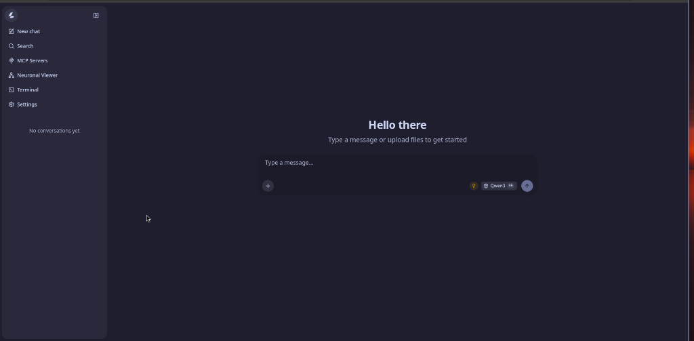
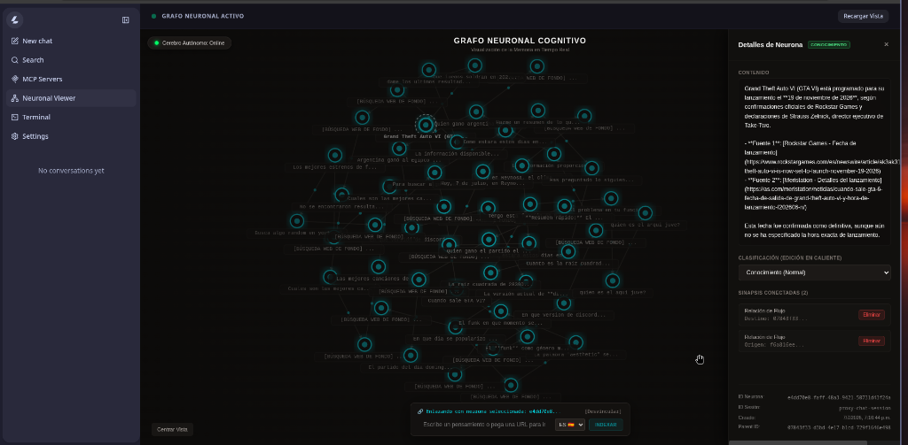

# 🧠 mem-neuro: Motor Cognitivo Persistente

> **Conecta modelos de lenguaje de gran tamaño con la recuperación persistente de conocimiento multi-fuente.**

[](https://python.org)
[](https://fastapi.tiangolo.com)
[](https://svelte.dev)
[](https://tailwindcss.com)
[](https://sqlite.org)
[](https://opensource.org/licenses/Apache-2.0)

🌎 **Languages / Idiomas:** [English](README.md) | [Español](README.es.md)

---

## 📸 Interfaz Visual

### 💬 Interfaz de Chat


### 🌐 Visor de Grafo Neuronal Cognitivo


---

## 🎯 ¿Qué es mem-neuro?

`mem-neuro` **no es un chatbot**, ni es un RAG simple y genérico. Es un **Motor Cognitivo Persistente** que gestiona, organiza y sintetiza el conocimiento antes de enviarlo al modelo de lenguaje.

Al separar el **razonamiento sobre qué conocimiento se necesita** (Planificación Cognitiva) de **cómo se recupera** (Orquestación Multi-Fuente), `mem-neuro` actúa menos como un buscador web simple y más como un agente de navegación autónomo (similar a Claude Search o Perplexity).

---

## 🏛️ Pipeline Cognitivo del Core

```
Pregunta de Usuario + Historial
              │
              ▼
     [KnowledgePlanner] ◄─────── (Consulta de inmediato recuerdos en SQLite)
              │
              ├──► [¿Memoria Suficiente?] ──► Usa únicamente el RAG local
              │
              └──► [Requiere Ingesta Externa]
                            │
                    [KnowledgeSources] ── (Memoria, Docs, GitHub, WebSearch, News)
                            │
                 [Browserless Headless] ── (Scrapea el HTML renderizado en paralelo)
                            │
                 [Source Authority Re-Rank] ─ (Boost a dominios oficiales, github, docs)
                            │
                 [Semantic Re-Ranking] ─── (EmbeddingsClient cosine similarity)
                            │
                   [CitationBuilder] ───── (Construye bibliografía y citas [N])
                            │
                       LLM Context
```

### 🧠 1. Planificación de Conocimiento (`KnowledgePlanner`)
Antes de realizar peticiones externas, el `KnowledgePlanner` consulta la base de datos semántica vectorial local de SQLite. Evalúa mediante el LLM (o heurísticas de respaldo) si la información de memoria es suficiente y está actualizada. De ser así, omite las consultas externas ahorrando recursos y reduciendo tiempos.

### 🔌 2. Fuentes de Conocimiento Abstractas (`KnowledgeSources`)
El sistema abstrae las integraciones de datos en interfaces `KnowledgeSource` reutilizables:
* **`MemorySource`**: Búsquedas semánticas sobre SQLite.
* **`WebSearchSource`**: Búsquedas web en Bing, SearXNG o DuckDuckGo mediante Browserless.
* **`GitHubSource`**: Extracción y análisis de código en repositorios.
* **`OfficialDocsSource`**: Acceso directo y priorizado a documentaciones oficiales.

### 🛡️ 3. Source Authority Ranking y Diversificación
* **Diversidad de Dominios**: Excluye duplicados y limita a un máximo de 2 enlaces por dominio para evitar sesgos informativos.
* **Boost de Autoridad**: Re-ordena resultados asignando boosts según el plan del planificador (ej. GitHub `+2.0`, Docs Oficiales `+2.0`, dominios `.gov`/`.edu` `+1.5`, Wikipedia `+1.0`) y descarta dominios clasificados en listas de spam.

### 📚 4. Citation Builder y Bibliografía (`CitationBuilder`)
Todos los fragmentos seleccionados (locales y externos) se fusionan, se rerankean semánticamente contra la query original, y se les asigna un marcador bibliográfico único (ej. `[1]`, `[2]`). Una sección detallada de referencias se adjunta al final para obligar al LLM a fundamentar rigurosamente sus afirmaciones.

---

## 🛠️ Estructura del Proyecto

```text
mem-neuro/
├── config.yaml                      # Configuración global centralizada
├── Proyecto.md                      # Especificación técnica del sistema
├── assets/                          # Recursos visuales
│   └── ui_mockup.png                # Mockup de la interfaz del chat
│
├── cerebro_unificado/
│   ├── backend/                     # Motor Cognitivo en Python (FastAPI)
│   │   ├── main.py                  # Endpoints y lifespan
│   │   ├── search_orchestrator.py   # Orquestador Multi-Fuente
│   │   ├── knowledge_planner.py     # Módulo de planificación cognitiva
│   │   └── database.py              # Capa de datos en SQLite WAL
│   │
│   └── frontend/                    # Interfaz en Svelte 5 + Tailwind CSS v4
```

## 🚀 Instalación y Puesta en Marcha

Sigue esta guía paso a paso para configurar la infraestructura completa en tu entorno local.

---

### 1. Infraestructura Docker (Browserless y SearXNG)

Levanta ambos servicios de apoyo exclusivamente en contenedores Docker:

* **Browserless** (Navegación Headless):
  ```bash
  docker run -d \
    --name browserless \
    -p 127.0.0.1:3000:3000 \
    --restart always \
    browserless/chrome:latest
  ```

* **SearXNG** (Agregador de Motores de Búsqueda):
  ```bash
  docker run -d \
    --name searxng \
    -p 127.0.0.1:8888:8080 \
    --restart always \
    searxng/searxng:latest
  ```

> [!NOTE]
> Enlazar los puertos a `127.0.0.1` asegura que los servicios sólo sean accesibles de manera local, protegiendo tu entorno de desarrollo.

---

### 2. Configuración de Firewall (`ufw`)

Gestiona el acceso a los distintos puertos del motor cognitivo. Se recomienda enlazar las reglas a `127.0.0.1` para evitar accesos no autorizados a través de la red local:

```bash
# Permitir conexiones locales a los puertos del core y LLMs
sudo ufw allow from 127.0.0.1 to any port 8000 proto tcp comment 'FastAPI Backend'
sudo ufw allow from 127.0.0.1 to any port 8080 proto tcp comment 'llama.cpp Chat'
sudo ufw allow from 127.0.0.1 to any port 8081 proto tcp comment 'llama.cpp Embeddings'
sudo ufw allow from 127.0.0.1 to any port 3000 proto tcp comment 'Browserless Docker'
sudo ufw allow from 127.0.0.1 to any port 8888 proto tcp comment 'SearXNG Docker'

# Activar el firewall
sudo ufw enable
```

---

### 3. Descarga Local de Modelos (`hf` CLI)

Usa la interfaz de comandos oficial de Hugging Face (`hf`) para descargar directamente las versiones GGUF:

```bash
# 1. Descargar pesos del modelo de Chat/Razonamiento Qwen 14B
hf download Bartowski/DeepSeek-R1-Distill-Qwen-14B-GGUF DeepSeek-R1-Distill-Qwen-14B-Q4_K_M.gguf --local-dir ./models

# 2. Descargar pesos del modelo de Embeddings mxbai
hf download mixedbread-ai/mxbai-embed-large-v1 mxbai-embed-large-v1-f16.gguf --local-dir ./models
```

---

### 4. Compilación Local de `llama.cpp`

Evita el uso de gestores de paquetes externos. Clona y compila el repositorio de forma local:

```bash
# Clonar el repositorio oficial
git clone https://github.com/ggerganov/llama.cpp.git
cd llama.cpp

# Compilar para ejecución en CPU únicamente
make

# O compilar con aceleración GPU mediante NVIDIA CUDA
make GGML_CUDA=1
```

---

### 5. Configuración de API Keys (Google YouTube v3)

Para poder recuperar resultados de vídeo desde YouTube, obtén una clave de API desde Google Cloud Console habilitando la "YouTube Data API v3", y defínela en tu entorno:

```bash
# Exportación temporal
export YOUTUBE_API_KEY="tu-api-key-de-youtube"

# Configuración persistente
echo 'export YOUTUBE_API_KEY="tu-api-key-de-youtube"' >> ~/.bashrc
source ~/.bashrc
```

---

### 6. Configuración de Servicios systemd de Usuario

Para automatizar la ejecución de los tres servicios cognitivos, define los siguientes archivos de unidad en `~/.config/systemd/user/`:

#### A. `cerebro-llama-chat.service` (Servidor de Chat en el Puerto 8080)
```ini
[Unit]
Description=Cerebro llama.cpp Chat Server
After=network.target

[Service]
ExecStart=/path/to/llama.cpp/llama-server -m /path/to/models/DeepSeek-R1-Distill-Qwen-14B-Q4_K_M.gguf -c 4096 --port 8080 --host 127.0.0.1
Restart=on-failure

[Install]
WantedBy=default.target
```

#### B. `cerebro-llama-embeddings.service` (Servidor de Embeddings en el Puerto 8081)
```ini
[Unit]
Description=Cerebro llama.cpp Embeddings Server
After=network.target

[Service]
ExecStart=/path/to/llama.cpp/llama-server -m /path/to/models/mxbai-embed-large-v1-f16.gguf --port 8081 --host 127.0.0.1 --embeddings --pooling mean
Restart=on-failure

[Install]
WantedBy=default.target
```

#### C. `cerebro-brain-core.service` (Backend Principal en FastAPI)
```ini
[Unit]
Description=Cerebro Autonomous Core Backend
After=network.target

[Service]
WorkingDirectory=%h/mem-neuro/cerebro_unificado/backend
ExecStart=/usr/bin/python3 main.py
Restart=on-failure

[Install]
WantedBy=default.target
```

Para habilitar e iniciar los tres servicios de usuario en segundo plano:
```bash
systemctl --user daemon-reload
systemctl --user enable --now cerebro-llama-chat.service
systemctl --user enable --now cerebro-llama-embeddings.service
systemctl --user enable --now cerebro-brain-core.service
```

---

### 7. Despliegue del Frontend

1. Navega al directorio del cliente Svelte:
   ```bash
   cd cerebro_unificado/frontend
   ```
2. Instala los paquetes de Node:
   ```bash
   npm install
   ```
3. Inicia el servidor de desarrollo local:
   ```bash
   npm run dev
   ```

---

## 📄 Licencia
Licencia Apache 2.0. Consulta [LICENSE](LICENSE) para más detalles.
