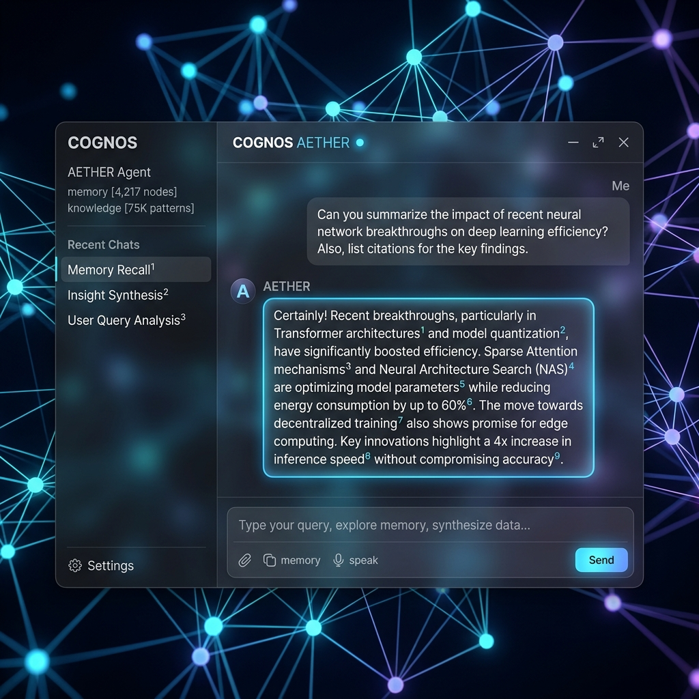

# 🧠 mem-neuro: Persistent Cognitive Engine

> **Bridges the gap between Large Language Models and persistent, multi-source knowledge retrieval.**

[](https://python.org)
[](https://fastapi.tiangolo.com)
[](https://svelte.dev)
[](https://tailwindcss.com)
[](https://sqlite.org)
[](https://opensource.org/licenses/Apache-2.0)

🌎 **Languages / Idiomas:** [English](README.md) | [Español](README.es.md)

---

## 📸 Interface Visual



---

## 🎯 What is mem-neuro?

`mem-neuro` is **not a chatbot**, nor is it a simple RAG wrapper. It is a **Persistent Cognitive Engine** that manages, structures, and synthesizes knowledge before it reaches the LLM. 

By separating the **reasoning about what knowledge is needed** (Cognitive Planning) from **how that knowledge is retrieved** (Multi-Source Orchestration), `mem-neuro` behaves less like a keyword-search tool and more like an agentic browser/reasoning system (analogous to Claude Search or Perplexity).

---

## 🏛️ Core Cognitive Pipeline

```
User Query + Chat History
           │
           ▼
   [KnowledgePlanner] ◄─────── (Instantly queries SQLite Semantics)
           │
           ├──► [Sufficient in Memory?] ──► Use local RAG context only
           │
           └──► [Requires External Ingestion]
                        │
                [KnowledgeSources] ── (Memory, Docs, GitHub, WebSearch, News)
                        │
             [Browserless Headless] ── (Scrapes rendered HTML in parallel)
                        │
             [Source Authority Re-Rank] ─ (Boosts official domains, github, docs)
                        │
             [Semantic Re-Ranking] ─── (EmbeddingsClient cosine similarity)
                        │
               [CitationBuilder] ───── (Builds bibliography and strict [N] markers)
                        │
                   LLM Context
```

### 🧠 1. Cognitive Planning (`KnowledgePlanner`)
Before performing any web request, the `KnowledgePlanner` queries the local SQLite semantic vector database. It then evaluates (via a quick LLM call or fallback heuristics) if the local memories are sufficient and up-to-date. If they are, it avoids making external web requests, protecting bandwidth and reducing latency.

### 🔌 2. Abstract Knowledge Sources (`KnowledgeSources`)
The system defines a modular `KnowledgeSource` abstraction, making it easy to plug in new knowledge providers:
* **`MemorySource`**: Vector search over SQLite nodes.
* **`WebSearchSource`**: Web search queries using Bing, SearXNG, or DuckDuckGo via Browserless.
* **`GitHubSource`**: Scraping and searching code repositories.
* **`OfficialDocsSource`**: Direct target of developer documentation.

### 🛡️ 3. Source Authority Ranking & Domain Diversity
* **Diversification**: Excludes duplicates and limits to a maximum of 2 links per domain to avoid bias.
* **Authority Boosts**: Re-ranks search results by boosting GitHub repositories (`+2.0`), official docs (`+2.0`), academic/official domains (`.gov`, `.edu` `+1.5`), and Wikipedia (`+1.0`), while filtering out spam domains.

### 📚 4. Citation Builder & Bibliography (`CitationBuilder`)
All selected text segments (both from local memory and scraped pages) are merged, semantically re-ranked against the query, and assigned a strict bibliographical marker (e.g. `[1]`, `[2]`). A detailed bibliography is attached at the end of the context, instructing the LLM to strictly base its claims on these sources.

---

## 🛠️ Project Structure

```text
mem-neuro/
├── config.yaml                      # Centralized configuration
├── Proyecto.md                      # Detailed architectural specification
├── assets/                          # Images and visual assets
│   └── ui_mockup.png                # Chat visual interface preview
│
├── cerebro_unificado/
│   ├── backend/                     # Python Cognitive Engine (FastAPI)
│   │   ├── main.py                  # API endpoints and lifespans
│   │   ├── search_orchestrator.py   # Multi-Source Orchestrator
│   │   ├── knowledge_planner.py     # Cognitive planner module
│   │   └── database.py              # WAL SQLite persistence layer
│   │
│   └── frontend/                    # Svelte 5 + Tailwind CSS v4 Chat Interface
```

---

## 🚀 Getting Started

### 1. Prerequisites
- Docker (running Browserless on port `3000`):
  ```bash
  docker run -p 3000:3000 browserless/chrome:latest
  ```
- Local LLM/Embeddings Servers (running on ports `8080` and `8081`).

### 2. Backend Setup
1. Navigate to the backend directory:
   ```bash
   cd cerebro_unificado/backend
   ```
2. Install Python dependencies:
   ```bash
   pip install -r requirements.txt
   ```
3. Run the FastAPI core:
   ```bash
   python main.py
   ```

### 3. Frontend Setup
1. Navigate to the frontend directory:
   ```bash
   cd cerebro_unificado/frontend
   ```
2. Install Node dependencies:
   ```bash
   npm install
   ```
3. Run the development server:
   ```bash
   npm run dev
   ```

---

## 📄 License
Licensed under the Apache License, Version 2.0. See [LICENSE](LICENSE) for details.
